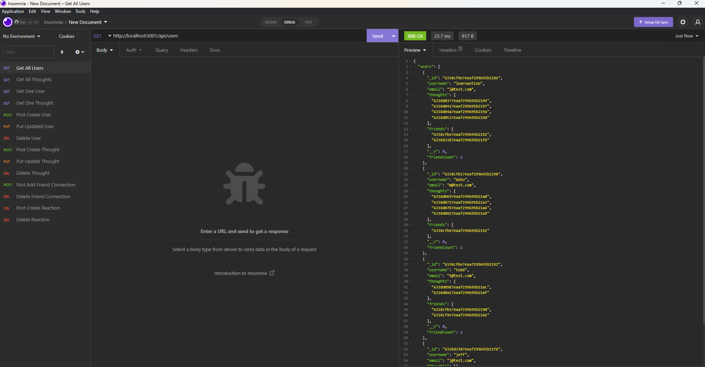

# Social Network API

This repo is a api for a social network. It allows for the creation, updating and deletion of users, their thoughts and reactions to other users thoughts. Additionally it allows for friend connections to be established.

[Link to Recording of Walkthrough](https://drive.google.com/file/d/1VeDpVx_wMkCaHlrqeLOhW9uZDQBIWirI/view?usp=sharing)

